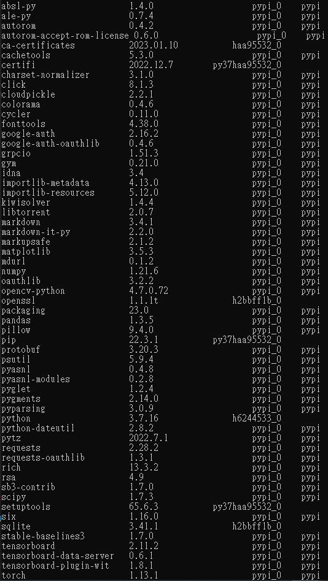
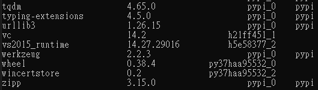

# ns3-python

## Preparation
1. Download Python 3.7.16, and follow the introductuins provided by [sb3-contrib](https://sb3-contrib.readthedocs.io/en/master/modules/trpo.html) to install the required packages.
2. For the ORWP mobility model, follow the introductions provided by [pymobility](https://github.com/panisson/pymobility) to install the required components.

## Run Simulation
### Parameter Setting
We have the flexibility to configure various parameters by modifying the `global_configuration.py`.For instance, if we wish to set the total number of users to 30, we can simply assign the value 30 to the `UE_num` variable defined in `global_configuration.py`.

### Using Pre-training Model
1. If the network environment remains unchanged, the model only needs to be trained once and will be saved as `trpo_LAHLWN_UE..`, where the number of following *UE* represents the total number of users.
2. If there is no need to train the model, `line 28` to `line 32` in `trpo.py` can be commented out, and `line 35` in `trpo.py` specifies the loading of the pre-trained model.

> Remerber to load a model that matches your configured network environment, otherwise it will result in error.

### Appendix
1. Packages List
- 
- 